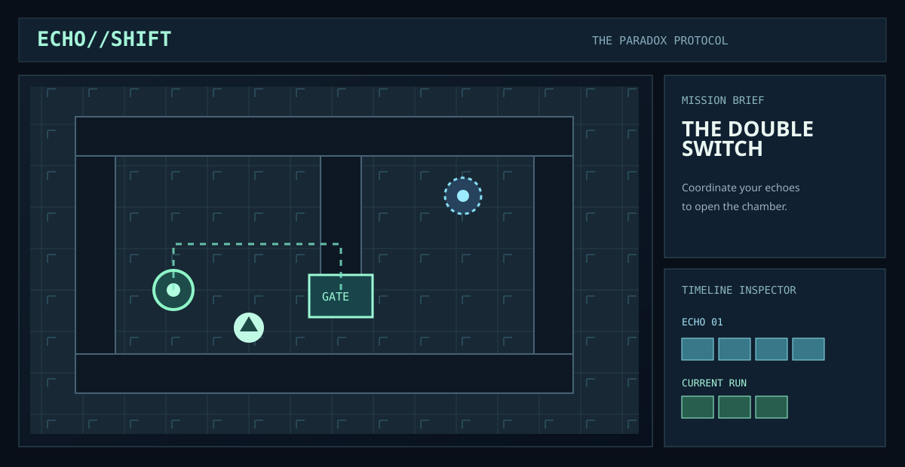

<div align="center">

# ECHO//SHIFT
### THE PARADOX PROTOCOL

**Your past is playable.**

A sci-fi time-loop puzzle game about cooperating with recordings of your past self to escape nine experimental chambers.



*Gameplay overview illustration · [Launch ECHO//SHIFT](./index.html)*

**[Play ECHO//SHIFT](https://blitzbot-gaming.github.io/echo-shift/)** · **[Architecture notes](./ARCHITECTURE.md)**

</div>

> The browser-playable game is included in `index.html` and `docs/index.html`. The online play link will work after GitHub Pages is enabled.

## About the game

Every move can become part of your next attempt. Record a sequence, rewind to the beginning, and watch an echo repeat your actions. Use the echoes to hold switches, unlock gates, and navigate each chamber.

ECHO//SHIFT combines turn-based, grid-based puzzles with a timeline inspector that lets you examine recorded actions without changing the current run.

## Features

- **Nine chambers** spread across three acts.
- **Time-loop echoes** that replay your movements and hold their last position.
- **Circuit-based puzzles** with switches and doors.
- **Timeline inspector** for reviewing recorded moves.
- **Undo, rewind and restart** controls.
- **Keyboard and touch** support.
- **Hints and progression** saved locally in the browser.
- **Replay import and export** using JSON.
- Original procedural graphics rendered with HTML Canvas 2D.

## Play

Open [the playable game](./index.html) directly in a browser, or use the [GitHub Pages version](https://blitzbot-gaming.github.io/echo-shift/) after deployment.

No installation is required for the standalone HTML build.

### Controls

| Input | Action |
|---|---|
| Arrow keys / WASD | Move one tile |
| Space | Wait one beat |
| R | Record your current run and rewind |
| Z | Undo the last move |
| X | Retry the current loop |
| Escape | Close a dialog or return to chamber selection |
| H | Show instructions |
| On-screen controls | Move and interact on touch devices |

### How echoes work

1. Walk to a pressure plate.
2. Press **R** to save your actions as an echo.
3. Start again from the beginning of the room.
4. Your echo repeats your earlier route while you move independently.
5. Coordinate with it to keep gates open and reach the exit.

Later levels introduce more echoes and more complex circuits.

## Technology

- **TypeScript** — game systems and project configuration.
- **Canvas 2D** — rendering and visual effects.
- **HTML, CSS and JavaScript** — game interface and controls.
- **Web Audio API** — generated sound effects.
- **localStorage** — local settings and completion progress.

The standalone game runs without third-party runtime dependencies. The repository also includes the full TypeScript source, generated modular web build and automated engine tests.

See [ARCHITECTURE.md](./ARCHITECTURE.md) for details on simulation, echo replay, circuit rules, and data formats.

## Development

Clone the repository and install Node.js 20 or later, then run:

```bash
npm install
npm run build
npm test
npm start
```

Open **http://localhost:4173** to play the modular development build.

The game source lives in `src/`, automated tests in `tests/`, and the generated website in `docs/`. Run `npm run build` after changing TypeScript. The self-contained `index.html` at the repository root is the GitHub Pages release. The `docs/` build is intended for local development and modular hosting.

### Project structure

```text
src/                       TypeScript game engine, renderer and UI
tests/                     Gameplay logic and solvability checks
docs/                      Modular browser build
examples/                  Saved replay examples
index.html                 Standalone browser release
ARCHITECTURE.md            Simulation and architecture reference
CONTRIBUTING.md            Development and contribution guidelines
```

### Automated checks

The GitHub Actions workflow compiles the TypeScript and runs the Node.js test suite on pushes and pull requests.

## Hosting with GitHub Pages

1. Open **Settings → Pages**.
2. Under **Build and deployment**, select **Deploy from a branch**.
3. Select **main** and **/ (root)**.
4. Save and wait for deployment.

The live game URL will be **https://blitzbot-gaming.github.io/echo-shift/**.

## License

See [LICENSE](./LICENSE) if present. The game interface uses original procedural visuals and does not require externally hosted art assets.
